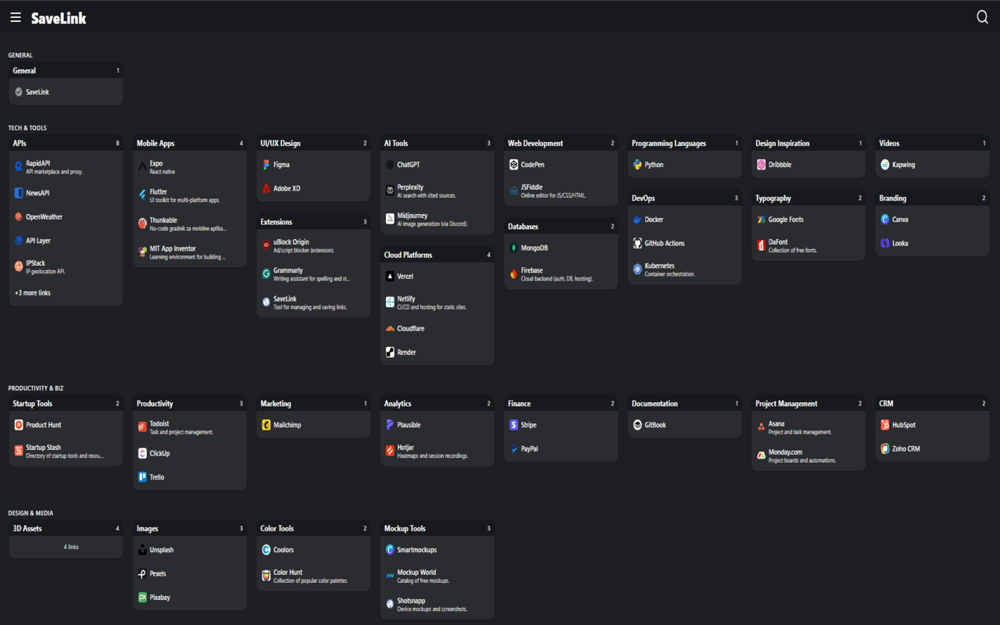

<h1 align="center">SaveLink</h1>

<strong>Private, fast, and powerful link manager — built for scale.</strong>

  
  
  
   
  <small>All data stays <strong>local</strong> in your browser. No accounts. No tracking.</small>
  

---

## 🚀 Why SaveLink stands out

- <strong>Privacy by design</strong>: local storage only, no cloud sync, no telemetry.
- <strong>Blazing-fast UX</strong>: lazy loading, passive listeners, optimized scrolling, and a responsive masonry layout for large collections.
- <strong>Power user workflows</strong>: global shortcuts, context menus, selective imports, duplicate handling, and automated backups with compression.

---

## 🧠 Advanced capabilities

### 🔍 Search & discovery
- <strong>Full‑text search</strong> across title, URL, notes, categories, and group names
- <strong>Inline highlighting</strong> of matches and <strong>smart suggestions</strong>
- <strong>Instant toggle</strong> with `Ctrl+F` and one‑tap close/clear

### 🗂 Organization at scale
- <strong>Groups</strong> containing categories for clear hierarchy
- <strong>Drag & drop</strong> categories across groups and re‑order links within categories
- <strong>Masonry layout</strong> for compact, responsive grids with multi‑pass layout stabilization

### 📥 Import, Preview & Safe Merge
- <strong>Visual import preview</strong> with per‑item checkboxes
- <strong>Duplicate detection</strong> for links, categories, and groups with automatic group renaming on conflicts
- <strong>Selectively import settings</strong> alongside data

### 💾 Export & Automated Backups
- <strong>Selective export</strong> (links, categories, groups, settings)
- <strong>Auto‑backup scheduler</strong> (daily/weekly/monthly)
- <strong>Compression built‑in</strong> (LZ‑string) with size stats and “skip unchanged” logic
- <strong>Backup library</strong> with restore/delete, counts, and size per backup

### 🧹 Data quality tools
- <strong>Broken link checker</strong> with parallel checks, timeouts, CORS‑safe fallbacks, and in‑UI open/delete
- <strong>Duplicate remover</strong> (grouped by URL) with one‑click cleanup
- <strong>Empty category cleaner</strong> with bulk delete
- <strong>Undo/redo history</strong> persisted across sessions

### ⚡ Performance & reliability
- <strong>Enhanced Performance Manager</strong> (lazy components, DOM caching, preloading, memory cleanup)
- <strong>Optimized scroll</strong> and passive event listeners for smooth navigation
- <strong>Resilient</strong> background/content messaging with timeouts and retries

### 🛎 Notifications that don’t spam
- Deduplicated toasts with expandable messages and auto‑dismiss timers

### 🎯 Power shortcuts & quick capture
- <strong>Global commands</strong>: save page, save all tabs, open SaveLink (`Ctrl+Shift+S/A/L`)
- <strong>In‑app shortcuts</strong>: search, sidebar toggle, add link/category, settings, undo/redo
- <strong>Smart validation</strong>: duplicate detection, browser‑conflict warnings, and one‑click reset to defaults

### 🎨 Appearance
- Prebuilt themes: <strong>Dark</strong>, <strong>Light</strong>, <strong>Green</strong>, <strong>Blue</strong>, <strong>Pink</strong>
- Read‑only color previews mapped to CSS variables for clarity

### ⚙️ Settings for control
- Storage usage meter with live percentage
- Toggle visibility (favicons, notes, headers), links per column, card size, collapse behavior
- Default category and behavior confirmations

---

## 📌 How capturing works
- <strong>Context menus</strong>: save page or any link with right‑click
- <strong>Toolbar popup</strong>: edit title/category/notes and save
- <strong>Content script</strong>: save from any page using shortcuts
- Automatic title and favicon retrieval

---

## 🔐 Security & permissions
- <code>storage</code>, <code>activeTab</code>, <code>contextMenus</code>, <code>&lt;all_urls&gt;</code> for reliable capture and utilities
- Strict extension CSP; no remote code execution
- Local‑first backups with optional file download

---

## 📦 Install

Quick start:
1) Install from your store above.
2) Press <strong>Ctrl+Shift+S</strong> to save the current page or <strong>Ctrl+Shift+A</strong> to save all tabs.
3) Open SaveLink to organize, search, import/export, and back up.

---

  If you enjoy SaveLink, you can support development:

  

